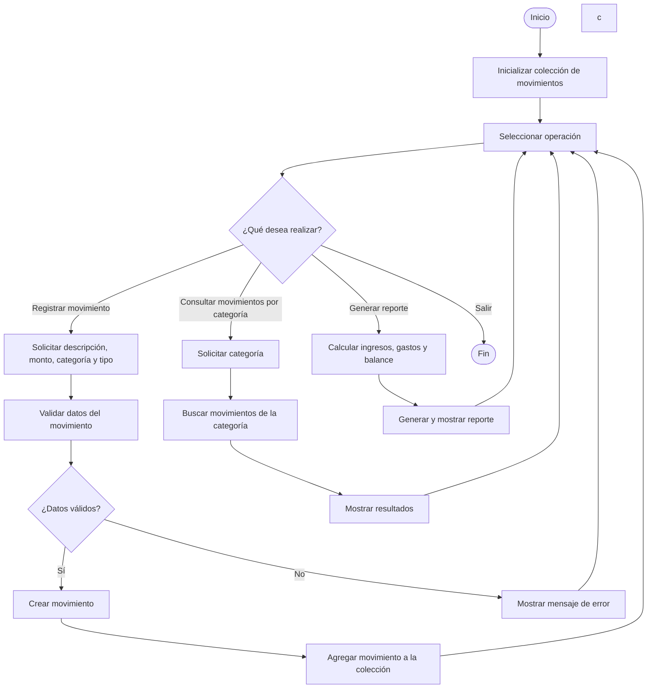
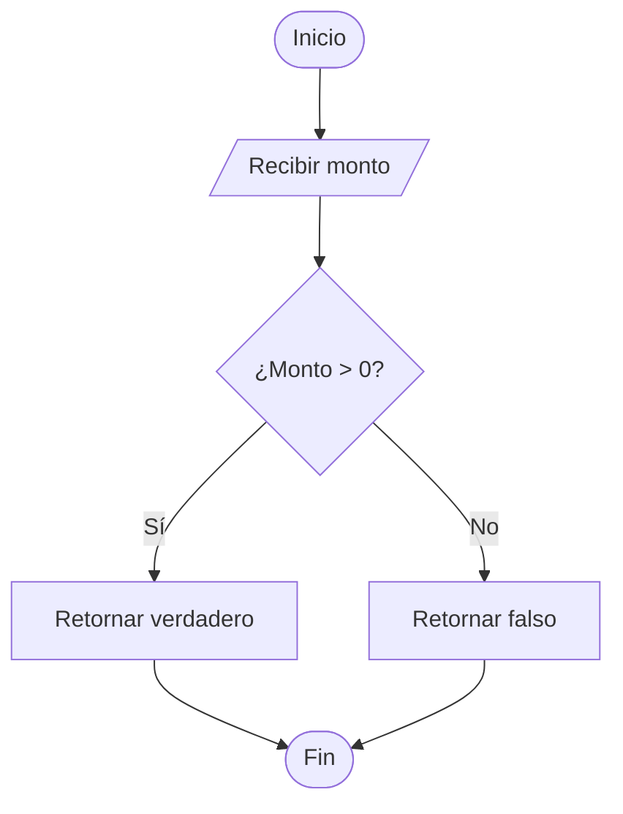
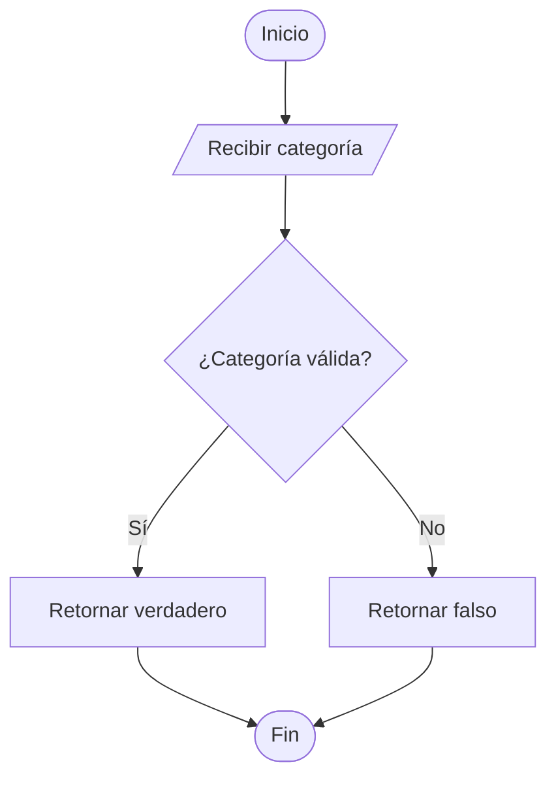
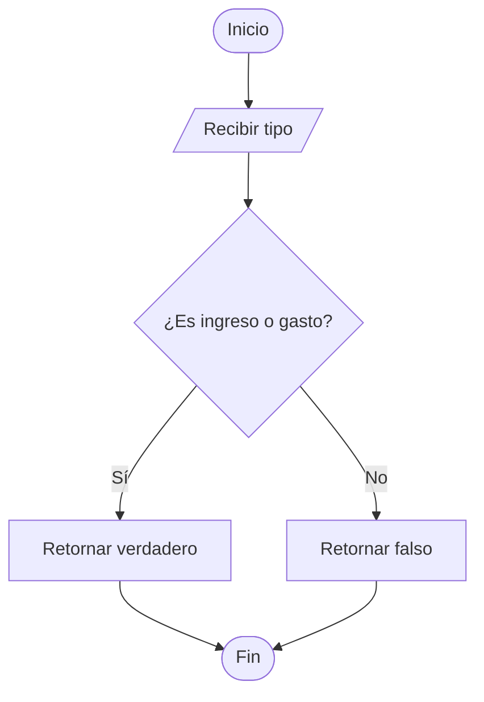
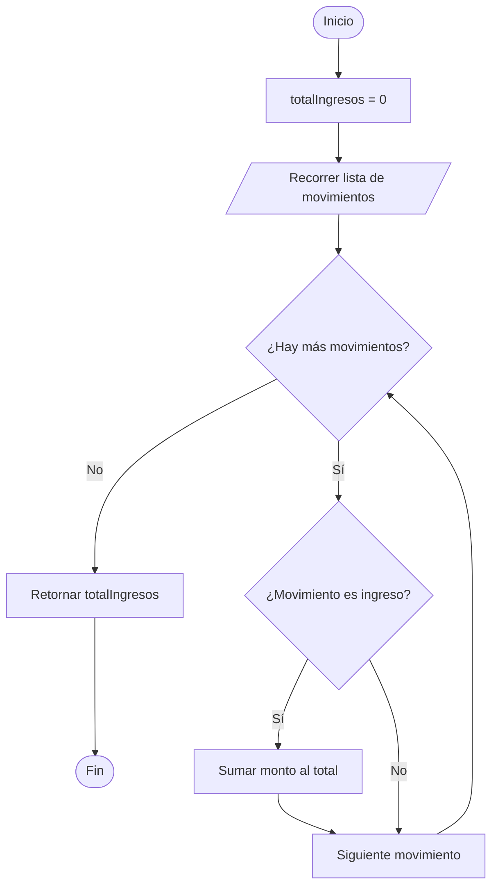
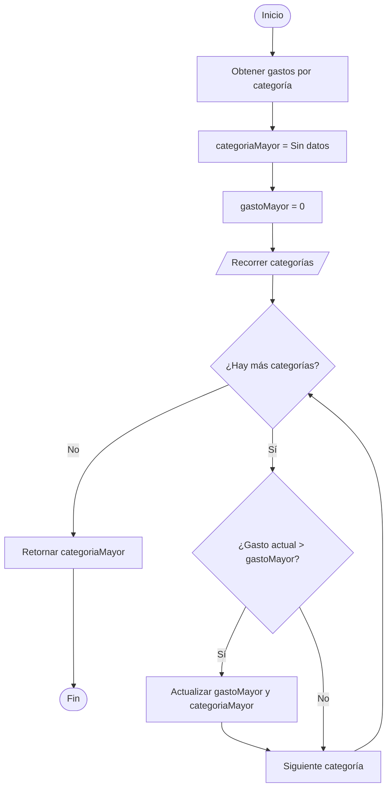
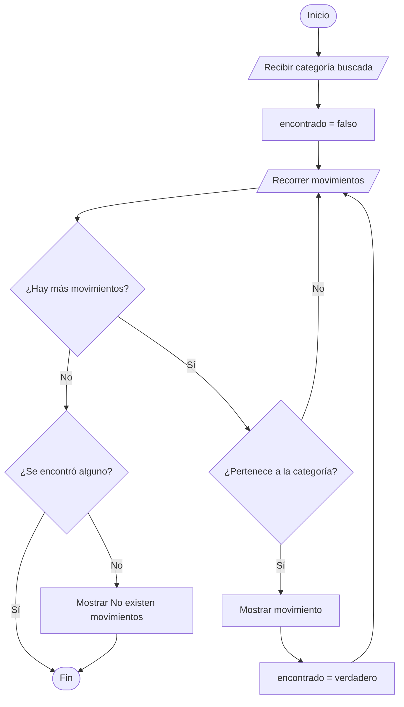
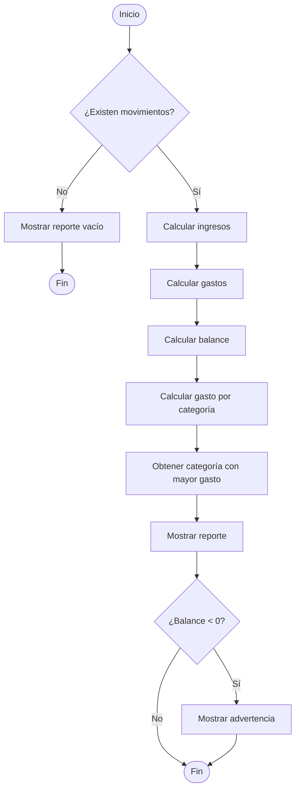

# ExtraordinarioXimena
Extraordinario Amerike Ximena Senties Ruiz
## Sistema de Gestión de Finanzas Personales
## 1. Descripción del problema
Este sistema sirve para que una persona pueda llevar un control claro de su dinero sin complicarse. La idea es que el usuario pueda registrar cada movimiento que hace, ya sea un ingreso o un gasto, y guardarlo junto con una descripción, un monto y una categoría como Alimentación, Transporte, Entretenimiento, Servicios u Otros.

Antes de guardar cualquier movimiento, el sistema revisa que los datos tengan sentido: que el monto sea mayor a cero, que la categoría exista y que el tipo realmente sea ingreso o gasto. Con toda esta información validada, el sistema va acumulando los movimientos y después puede calcular cosas importantes como el total de ingresos, el total de gastos y el balance actual.

Además, el sistema ayuda a entender en qué se está gastando más, mostrando el total por categoría y permitiendo ver solo los movimientos de una categoría específica. Al final, genera un reporte completo donde se ve el estado general del dinero del usuario, incluyendo una advertencia si los gastos ya superaron a los ingresos.


## 2. Diagrama de flujo 


## 3. Pseudocódigo

### Módulo de validación
#### validarMonto()
```text
FUNCION validarMonto(monto)

    SI monto > 0 ENTONCES
        RETORNAR verdadero
    SI NO
        RETORNAR falso
    FIN SI

FIN FUNCION
```
#### validarCategoria()
```text

FUNCION validarCategoria(categoria)
    categoriasValidas = [
        "Alimentos", "Transporte", "Servicios", "Entretenimiento", "Otros"
        ]

    SI categoria ESTA_EN categoriasValidas ENTONCES 
        RETORNAR verdadero
    SI NO
        RETORNAR falso
    FIN SI

FIN FUNCION
```

#### validarTipo()
```text

FUNCION validarTipo(tipo)
    

    SI tipo == "Ingreso" O tipo == "Gasto"
    ENTONCES
        RETORNAR verdadero
    SI NO
        RETORNAR falso
    FIN SI

FIN FUNCION
```

### Módulo de datos
#### registarMovimiento()
```text

FUNCION registrarMovimiento(descripcion,monto,tipo,categoria)
    movimiento.descripcion = descripcion
    movimiento.monto = monto
    movimiento.tipo = tipo
    movimiento.categoria = categoria
    RETORNAR movimiento

FIN FUNCION
```

#### agregarMovimiento()
```text

FUNCION agregarMovimiento(listaMovimientos,movimiento)
    AGREGAR movimiento A listaMovimientos

FIN FUNCION
```

### Módulo de cálculo
#### calcularGastoPorCategoria() 
```text

FUNCION calcularGastoPorCategoria(listaMovimientos)
    gastoCategoria = DICCIONARIO_VACIO
    PARA CADA movimiento EN listaMovimientos HACER 
        SI movimiento.tipo == "Gasto" ENTONCES 
            gastoCategoria[movimiento.categoria] =  gastoCategoria[movimiento.categoria] + movimiento.monto
        FIN SI
    FIN PARA
    RETONAR gastoCategoria

FIN FUNCION
```

#### calcularTotalIngresos()
```text

FUNCION calcularTotalIngresos(listaMovimientos)
    ingresosTotales = 0
    PARA CADA movimiento EN listaMovimientos HACER 
        SI movimiento.tipo == "Ingreso" ENTONCES 
            ingresosTotales = ingresosTotales  + movimiento.monto
        FIN SI
    FIN PARA
    RETONAR ingresosTotales

FIN FUNCION
```
#### calcularTotalGastos()

```text

FUNCION calcularTotalGastos(listaMovimientos)
    gastosTotales = 0
    PARA CADA movimiento EN listaMovimientos HACER 
        SI movimiento.tipo == "Gasto" ENTONCES 
            gastosTotales = gastosTotales  + movimiento.monto
        FIN SI
    FIN PARA
    RETONAR gastosTotales

FIN FUNCION
``` 
#### calcularBalance()
```text

FUNCION calcularBalance(ingresosTotales,gastosTotales)
    balanceTotal = 0
    balanceTotal = ingresosTotales - gastosTotales
   
    RETONAR balanceTotal

FIN FUNCION
```
#### determinarMayorGasto()
```text

FUNCION determinarMayorGasto(listaMovimientos)
    gastoCategoria = calcularGastoPorCategoria(listaMovimientos)
    mayorGasto = 0
    categoriaMayorGasto = ""
    PARA CADA categoria EN gastoCategoria HACER 
        SI gastoCategoria[categoria] > mayorGasto ENTONCES 
            mayorGasto = gastoCategoria[categoria]
            categoriaMayorGasto = categoria
        FIN SI
    FIN PARA
    RETONAR categoriaMayorGasto

FIN FUNCION
```

### Módulo de presentación
#### mostrarMovimientosCategoria()
```text

FUNCION mostrarMovimientosCategoria(listaMovimientos,categoriaBuscada)
    encontrado = falso
    PARA CADA movimiento EN listaMovimiento HACER 
        SI movimiento.categoria == categoriaBuscada ENTONCES 
            MOSTRAR movimiento.descripcion
            MOSTRAR movimiento.monto
            MOSTRAR movimiento.tipo
        encontrado = verdadero
        FIN SI
    FIN PARA 

        SI encontrado == falso ENTONCES 
            MOSTRAR "Error Categoria no encontrada"
        FIN SI

FIN FUNCION
```

#### generarReporte()
```text

FUNCION generarReporte(listaMovimientos)
   SI SIZE(listaMovimientos) == 0 ENTONCES
    MOSTRAR "No se encontraron movimientos en esta categoria"
    FIN SI

  totalIngresos = calcularTotalIngresos(listaMovimientos)
  totalGastos = calcularTotalGastos(listaMovimientos)
  totalBalance = calcularBalance(ingresosTotales,gastosTotales)
  gastosCategoria = calcularGastoPorCategoria(listaMovimientos)

  MOSTRAR "===== REPORTE FINANCIERO ====="

    MOSTRAR "Total ingresos: ", totalIngresos

    MOSTRAR "Total gastos: ", totalGastos

    MOSTRAR "Balance actual: ", totalBalance

    MOSTRAR "Desglose de gastos por categoría:"
    PARA CADA categoria EN gastosCategoria HACER 
        MOSTRAR categoria, gastoCategoria[categoria]
    FIN PARA 
    SI totalBalance < 0 ENTONCES
    MOSTRAR "ADVERTENCIA: CUIDA TUS GASTOS "


FIN FUNCION
```
#### programaPrincipal
```
INICIO

listaMovimientos = LISTA_VACIA

REPETIR

    MOSTRAR "1. Registrar movimiento"
    MOSTRAR "2. Consultar movimientos por categoría"
    MOSTRAR "3. Generar reporte"
    MOSTRAR "4. Salir"

    LEER opcion

    SEGUN opcion HACER

        CASO 1

            LEER descripcion
            LEER monto
            LEER categoria
            LEER tipo

            SI validarMonto(monto) == falso ENTONCES

                MOSTRAR "Monto inválido."

            SINO SI validarCategoria(categoria) == falso ENTONCES

                MOSTRAR "Categoría inválida."

            SINO SI validarTipo(tipo) == falso ENTONCES

                MOSTRAR "Tipo inválido."

            SINO

                movimiento =
                    crearMovimiento(
                        descripcion,
                        monto,
                        categoria,
                        tipo
                    )

                agregarMovimiento(
                    listaMovimientos,
                    movimiento
                )

                MOSTRAR
                "Movimiento registrado correctamente."

            FIN SI

        FIN CASO

        CASO 2

            LEER categoriaBuscada

            mostrarMovimientosCategoria(
                listaMovimientos,
                categoriaBuscada
            )

        FIN CASO

        CASO 3

            generarReporte(listaMovimientos)

        FIN CASO

        CASO 4

            MOSTRAR "Fin del sistema."

        FIN CASO

        OTRO CASO

            MOSTRAR "Opción inválida."

    FIN SEGUN

HASTA opcion == 4

FIN
```
## 4. Diagramas de Flujo de Funciones relevantes
### validarMonto()

### validarCategoria()

### validarTipo()

### calcularTotalIngresos()

### calcularTotalGastos()

### determinarMayorGasto()

### mostrarMovimientosCategoria()

### generarReporte

### 5. Justificacion.
 
 Para el almacenamiento de la información del sistema se optó por utilizar una lista de movimientos, debido a que todos los registros financieros, tanto ingresos como gastos, comparten la misma estructura de datos: descripción, monto, categoría y tipo. Esta elección permite gestionar los movimientos de manera flexible, ya que facilita la inserción de nuevos elementos y el recorrido completo de la lista cuando es necesario realizar cálculos, generar reportes o ejecutar consultas específicas. Cada movimiento se representa mediante una estructura que agrupa sus cuatro atributos principales. Esta organización centralizada evita la dispersión de información, reduce la duplicación de datos y permite acceder a los valores de forma ordenada y eficiente. Además, contribuye a mantener la coherencia interna del sistema, ya que todos los registros siguen un formato uniforme. En cuanto a las categorías, se definió un conjunto fijo de opciones: Alimentación, Transporte, Entretenimiento, Servicios y Otros. Estas categorías se establecen desde el inicio porque el problema indica que son conocidas previamente y no requieren modificaciones durante la ejecución del programa, lo que simplifica la validación y evita la necesidad de administrar categorías dinámicas.

El programa se estructuró en módulos con el propósito de asignar responsabilidades claras a cada componente y mejorar la legibilidad, el mantenimiento y la escalabilidad del sistema. Esta división modular permite que cada parte del código cumpla una función específica y que los cambios futuros puedan realizarse sin afectar el funcionamiento general. El módulo de validación se encarga de verificar que los datos ingresados cumplan con los criterios establecidos antes de ser registrados, garantizando que la información almacenada sea consistente y confiable. Por su parte, el módulo de datos administra la creación, almacenamiento y gestión de los movimientos financieros, centralizando las operaciones relacionadas con la estructura principal del sistema. El módulo de cálculo realiza las operaciones necesarias para obtener métricas relevantes, como el total de ingresos, el total de gastos, el balance general y el análisis por categoría, permitiendo procesar la información de manera ordenada y facilitando la generación de resultados útiles para el usuario. Finalmente, el módulo de presentación muestra la información mediante consultas y reportes, asegurando que los datos se presenten de forma clara y accesible. El programa principal actúa como coordinador general: recibe la operación seleccionada por el usuario, invoca los módulos correspondientes y gestiona el flujo de ejecución. Esta organización favorece que cada función tenga una única responsabilidad, lo que mejora la claridad del pseudocódigo y facilita la detección de errores, así como la implementación de futuras modificaciones sin comprometer el resto del sistema

### 6. Reflexion Final

El desarrollo de este sistema representó un desafío significativo que me permitió aplicar un pensamiento lógico, estructurado y orientado a la resolución de problemas. Aunque el sistema no es particularmente complejo y no requiere un gran número de condicionales, su construcción implicó un proceso de análisis detallado y una planificación cuidadosa de cada uno de los componentes que lo integran.

Uno de los aspectos que más influyó en la dificultad del proyecto fue la necesidad de diseñar, organizar y articular adecuadamente los módulos y funciones. Cada módulo debía cumplir un propósito específico y, al mismo tiempo, integrarse de manera coherente con el resto del sistema. Este proceso demandó claridad conceptual y la capacidad de anticipar cómo interactuarían los distintos elementos entre sí para garantizar un funcionamiento fluido y eficiente.

A lo largo del desarrollo comprendí que la verdadera complejidad no radicaba en la lógica individual de cada función, sino en la correcta estructuración del sistema completo. La modularización, la definición de responsabilidades y la organización interna fueron los elementos que requirieron mayor atención. Sin embargo, una vez que los métodos, funciones y módulos estuvieron correctamente diseñados, la integración general del sistema resultó considerablemente más sencilla. En ese punto, el flujo de trabajo se volvió más natural, ya que únicamente fue necesario invocar cada componente en el momento adecuado, de acuerdo con las necesidades del usuario.

En conclusión, este proyecto no solo fortaleció mis habilidades técnicas, sino que también me permitió comprender la importancia de la planificación, la claridad estructural y el diseño modular en el desarrollo de sistemas.
