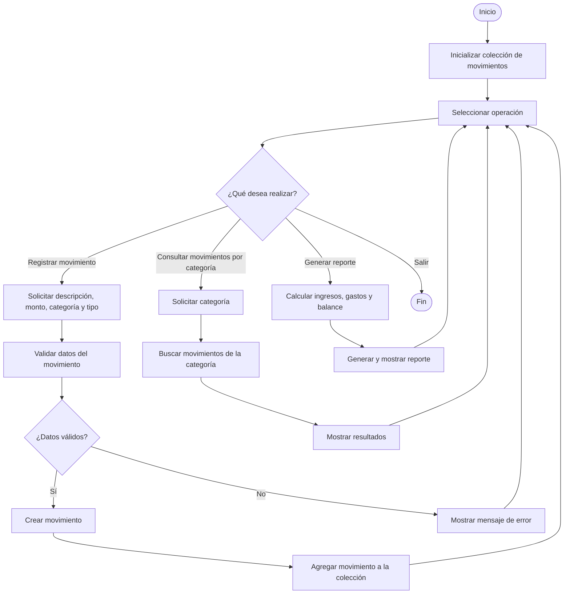

# ExtraordinarioXimena
Extraordinario Amerike Ximena Senties Ruiz
## Sistema de Gestión de Finanzas Personales
## 1. Descripción del problema

## 2. Diagrama de flujo 

## 3. Pseudocódigo

### Módulo de validación
validarMonto()
validarCategoria()
validarTipo()

### Módulo de datos
crearMovimiento()
agregarMovimiento()

### Módulo de cálculo
calcularGastoPorCategoria()
calcularTotalIngresos()
calcularTotalGastos()
calcularBalance()
determinarMayorGasto()

### Módulo de presentación
mostrarMovimientosCategoria()
generarReporte()
mostrarAdvertencia()